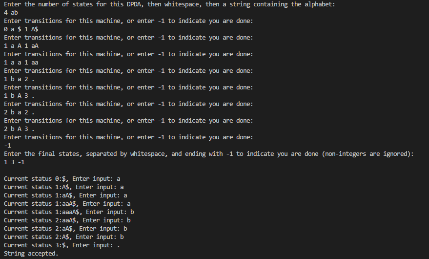
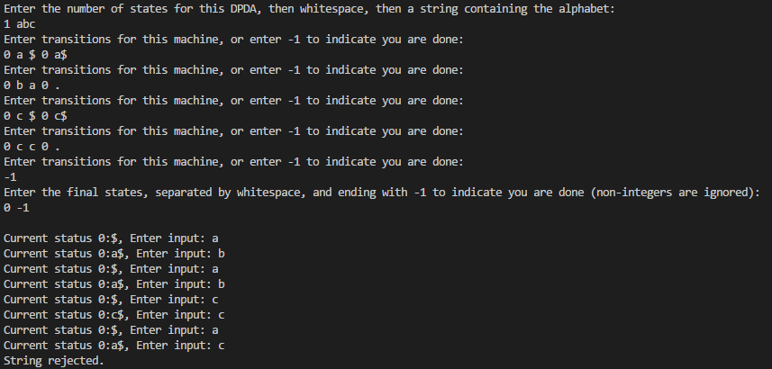

# Introduction

This project represents a deterministic push-down automata; a machine concept that utilizes one stack as memory in the process of determining the acceptance or rejection of a given string. My implementation of this machine is capable of handling exceptions where a user enters a description of the PDA that results in a non-deterministic machine instead of a deterministic one. Below is an example of its use in determining if a given string is accepted or rejected.

## Example

In this example, the user inputs the description of the PDA and then starts to input the string to test with. Each character inputted by the user results in the current state of the machine and its stack. If at any time the machine is in a trapped state, the program terminates with a message stating that the string is rejected. Otherwise, the program continues until a period is inputted.

Notes:

+ the period character represents:
  + lambda; an empty string (in the context of the user describing the PDA)
  + or the sentinel value used to indicate the user has entered all of the characters of the string to test

Accepting a string:

Rejecting a string:

